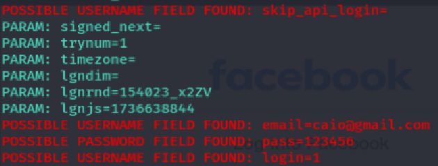
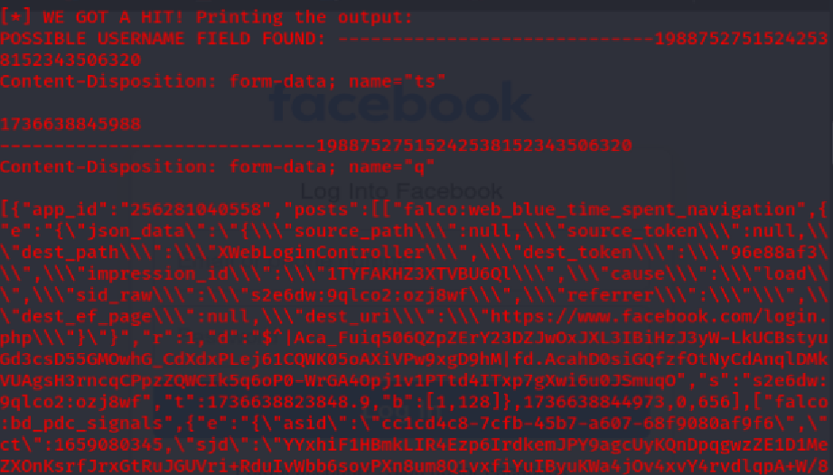

# Phishing para captura de senhas do Facebook

### Ferramentas

- Kali Linux
- setoolkit

### Configurando o Phishing no Kali Linux

- Acesso root: ``` sudo su ```
- Iniciando o setoolkit: ``` setoolkit ```
- Tipo de ataque: ``` Social-Engineering Attacks ```
- Vetor de ataque: ``` Web Site Attack Vectors ```
- Método de ataque: ```Credential Harvester Attack Method ```
- Método de ataque: ``` Site Cloner ```
- Obtendo o endereço da máquina: ``` ifconfig ```
- URL para clone: http://www.facebook.com
- (passos adicionais contra defesa do facebook) nano /root/.set/web_clone/index.html
- (passos adicionais contra defesa do facebook) excluir script

### Resutados



### Defesa Facebook
-> O site do facebook possui atualmente defesa contra scripts maliciosos, logo foi necessário excluir o script do arquivo criado pelo setoolkit para a captura dos dados. 


